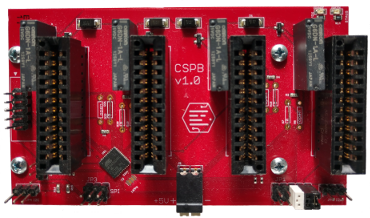

# Cluster System Power Board

## About

The Cluster System Power Board (CSPB) is a power distribution and control platform to simplify the construction of Single Board Computer Clusters. The power board is designed to allow for simple single cluster systems or complex multi board systems to be powered through one power supply and controlled from a single control module. Control of the power board is achieved via an i2c serial bus interface which can be chained across multiple power boards.
 

## The project
The project has three main components. The hardware design which can be found in the [Hardware](/Hardware) directory, the firmware code which can be found in the [Firmware](/Firmware) directory and some user interface software which can be found in the [Software](/Software) directory.

A detailed users manual can be found in the [Documents](\Documents)
 directory.
## Python package links:

[PIP cspb Package](https://pypi.org/project/cspb/)
 
[PIP cspb-tools Package](https://pypi.org/project/cspb-tools/)
